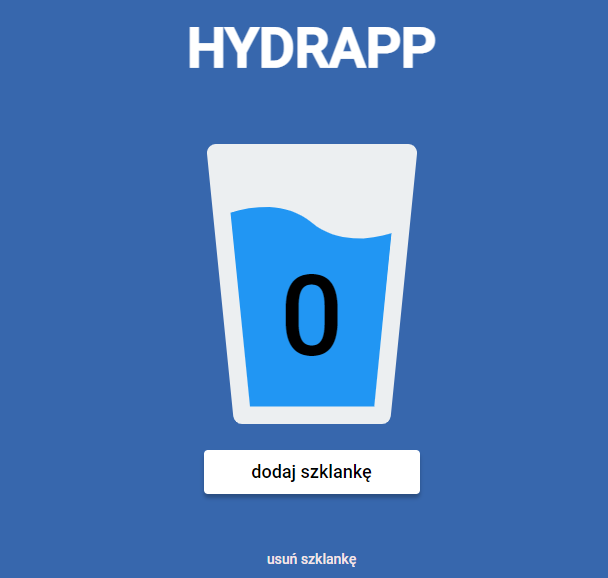

# HYDRAPP 📱

## HYDRAPP: 

PWA application. 

Adds and removes drinking glasses of water.

You can add HYDRAPP to your home screen.

Please visit website: [HYDRAPP](https://przemekjuzwiszin.github.io/HYDRAPP/)

### Tools and technologies I've used: 💼

- Visual Studio Code
- Git
- Trello
- Figma
- Gulp
- Markdown
- BEM
- PWA
- CSS: flex
- HTML
- JavaScript

### What I learned:

- Writing semantic HTML
- Building a responsive website
- Using BEM for styling
- Cutting the design
- Adding --js modifier to add JavaScript code
- Fill in the head addresses and descriptions to share 

### I learned something about:

- JS: Local storage
- Using a date as a key in local storage
- JS: DOM manipulations
- Progressive Web Apps

### Further development of the app:

- Displaying the history of the glasses of water drunk
- Hamburger menu
- Adding a new page with the history of drunk glasses of water
- CSS animation to make the water level rise and fall
- After clicking on the water counter add a glass of water 

#### How to run the page local?

[wtf-gulp-starter](https://github.com/maciejkorsan/wtf-gulp-starter)

To run the page locally, please follow the instructions below?

`npm install -g gulp-cli`

`npm install`

`gulp`

To publish your page using github pages use `npm run deploy`

#### If you are having problems installing npm packages and running gulp. Please follow the instructions below.

1. Clear npm cache with 

`npm cache clean --force`.

2. Install the last version.

`npm install node-sass@latest`

`npm rebuild node-sass`

`npm install`

`gulp`
